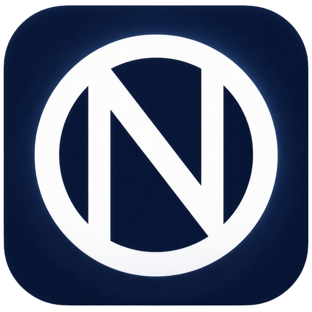
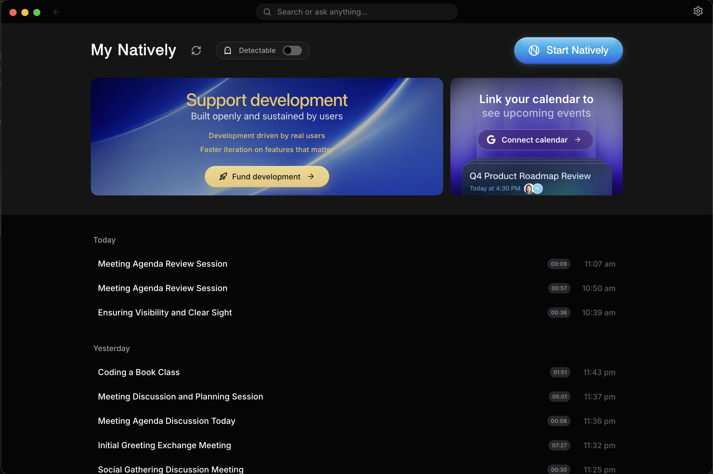
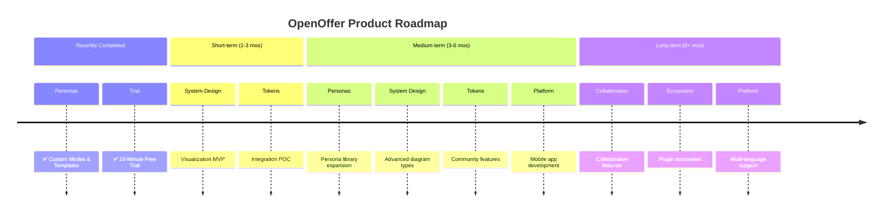

<div align="center">
  

# OpenOffer

Local-first, free, open-source assistant for interviews, career work, and meetings.

<br/>

[](LICENSE)
[](https://github.com/luiz2047/openoffer/releases)
[](https://github.com/luiz2047/openoffer/releases)
[](https://github.com/luiz2047/openoffer)


<p align="center">
  <a href="https://github.com/luiz2047/openoffer/releases/latest">
    
  </a>
  <a href="https://github.com/luiz2047/openoffer/releases/latest">
    
  </a>
</p>

<small>Requires macOS 12+ (Apple Silicon & Intel) or Windows 10/11</small>

<br/>

OpenOffer keeps your workflow local by default and gives you a place to work through interviews, meetings, and follow-up notes with the models you choose.

<div align="left">

### What it focuses on

- Local-first data handling and offline-capable workflows
- Live transcription, context recall, and follow-up drafting
- Custom modes for repeatable interview and meeting setups
- Reference files and local notes for role-specific context
- BYOK and local model support with no paid gate

</div>

---

## At a glance

OpenOffer is built for people who want a desktop assistant they can keep on their machine. It is open source, works with local or hosted models, and centers on live interview and meeting workflows rather than a browser-only wrapper.

- **Local by default:** audio, notes, and session state stay on your machine unless you connect a provider.
- **Flexible model setup:** use cloud APIs, local models, or a mixed configuration.
- **Interview and work modes:** switch between reusable personas and context templates.
- **Reference files:** attach documents that should influence the current session.
- **Desktop workflow:** capture, summarize, and draft follow-ups without leaving the app.

---

## What it looks like

The demo below shows the live workflow in motion:

- Real-time transcription as the meeting happens
- Rolling context across multiple speakers
- Screenshot analysis of shared slides
- Instant generation of what to say next
- Follow-up questions and concise responses


---

## Demo

This workflow is covered by the app smoke tests and will be published as a release asset instead of a large binary in Git history. It shows **a complete live meeting scenario**:

- Real-time transcription as the meeting happens
- Rolling context awareness across multiple speakers
- Screenshot analysis of shared slides
- Instant generation of what to say next
- Follow-up questions and concise responses
- All happening live, without recording or post-processing

---

## Full Comparison: OpenOffer vs Cluely vs Final Round AI vs LockedIn AI vs Interview Coder

| Feature                   | OpenOffer                   | Cluely               | Pluely     | LockedIn AI      | Final Round AI         |
| :------------------------ | :------------------------- | :------------------- | :--------- | :--------------- | :--------------------- |
| **Price**                 | ✅ Free (BYOK)             | ⚠️ $20/mo            | ✅ Free    | ❌ $55–70/mo     | ❌ $149/mo             |
| **Open source**           | ✅ AGPL-3.0                | ❌                   | ✅         | ❌               | ❌                     |
| **Local data / private**  | ✅ Yes                     | ❌ Cloud servers     | ✅ Yes     | ❌ Cloud servers | ❌ Cloud servers       |
| **Any LLM (BYOK)**        | ✅ Yes                     | ❌ Vendor-locked     | ⚠️ Limited | ❌ Vendor-locked | ❌ Vendor-locked       |
| **Local AI (Ollama)**     | ✅ Yes                     | ❌                   | ❌         | ❌               | ❌                     |
| **Local Whisper (On-Device)**| ✅ Yes                   | ❌                   | ❌         | ❌               | ❌                     |
| **Real-time <500ms**      | ✅ Yes                     | ⚠️ 5–90s lag         | ✅ Yes     | ✅ ~116ms        | ⚠️ Slowest             |
| **Dual audio channels**   | ✅ System + Mic            | ❌ Single stream     | ❌         | ❌               | ❌                     |
| **Local RAG memory**      | ✅ SQLite + sqlite-vec     | ❌                   | ❌         | ❌               | ❌                     |
| **Meeting history**       | ✅ Full dashboard          | ⚠️ Limited           | ❌         | ❌               | ⚠️ Limited             |
| **Screenshot OCR**        | ✅ Yes                     | ⚠️ Limited           | ❌         | ✅ Yes           | ⚠️ Limited             |
| **Stealth mode**          | ✅ Undetectable            | ❌                   | ❌         | ❌               | ❌ Visible to proctors |
| **Process Disguise**      | ✅ Terminal, Settings, etc | ❌                   | ❌         | ❌               | ❌                     |
| **Resume & context**      | ✅ Yes                     | ❌                   | ❌         | ✅ Yes           | ✅ Yes                 |
| **Custom Personas/Modes** | ✅ Yes                     | ✅ Yes               | ❌         | ❌               | ⚠️ Limited             |
| **Custom Context & Notes**| ✅ Yes                     | ❌                   | ❌         | ❌               | ❌                     |
| **Multi-Key API Pools**   | ✅ Yes                     | ❌                   | ❌         | ❌               | ❌                     |
| **Profile Intel Router**  | ✅ Yes                     | ❌                   | ❌         | ❌               | ❌                     |
| **Eager Code Expansion**  | ✅ Yes                     | ❌                   | ❌         | ❌               | ❌                     |
| **Live Follow-Up Resolver**| ✅ Yes                     | ❌                   | ❌         | ❌               | ❌                     |
| **Real-Time Latency Trace**| ✅ Yes                    | ❌                   | ❌         | ❌               | ❌                     |
| **Phone Link Companion**  | ✅ Yes                     | ❌                   | ❌         | ❌               | ❌                     |
| **Auto-Calendar Sync**    | ✅ Yes                     | ❌                   | ❌         | ❌               | ❌                     |
| **Smart Task Sync**       | ✅ Yes                     | ❌                   | ❌         | ❌               | ❌                     |
| **Speaker Diarization**   | ✅ Yes                     | ❌                   | ❌         | ❌               | ❌                     |
| **Codex CLI Integration** | ✅ Yes                     | ❌                   | ❌         | ❌               | ❌                     |
| **Offline SLM Mode**      | ✅ Yes                     | ❌                   | ❌         | ❌               | ❌                     |

> **Legend:** ✅ Full support · ⚠️ Partial or limited · ❌ Not available

---

## Why OpenOffer wins

### vs Cluely

If you've used similar tools before, OpenOffer keeps the workflow familiar while keeping data local by default. It is open source (AGPL-3.0) and supports custom personas and reference files.

### vs LockedIn AI — $70/month for cloud lock-in

LockedIn AI is the most expensive tool in the category at $55–70/month. It locks you into a single cloud LLM with no option for local inference. Every transcript and response passes through their servers.

OpenOffer supports every major model (Gemini, GPT, Claude, Groq) via bring-your-own-key, and offers 100% offline mode through Ollama. You pay only for the API tokens you actually use — or pay nothing at all by running Llama 3 locally. No paid gate, no vendor lock-in.

### vs Final Round AI

Final Round AI is oriented toward pre-interview prep and mock interviews. OpenOffer focuses more on live meeting and interview workflows, with local capture and model flexibility.

### vs Pluely

Pluely is lightweight and has Linux support. OpenOffer trades that simplicity for broader meeting, context, and history features.

### vs Interview Coder — More Powerful, Completely Free

Interview Coder is a paid tool focused specifically on coding interview assistance. OpenOffer does everything Interview Coder does — and more — for free:

|                                    |    OpenOffer    | Interview Coder |
| :--------------------------------- | :------------: | :-------------: |
| **Price**                          | ✅ Free (BYOK) |     ❌ Paid     |
| **Open source**                    |       ✅       |       ❌        |
| **Works on LeetCode / HackerRank** |       ✅       |       ✅        |
| **Screenshot + OCR analysis**      |       ✅       |       ✅        |
| **Real-time overlay**              |       ✅       |       ✅        |
| **Local AI / offline mode**        |   ✅ Ollama    |       ❌        |
| **Behavioral interview support**   |       ✅       |       ❌        |
| **System design support**          |       ✅       |       ❌        |
| **Meeting history & RAG**          |       ✅       |       ❌        |
| **Any LLM (BYOK)**                 |       ✅       |    ❌ Locked    |
| **Data stored locally**            |       ✅       |    ❌ Cloud     |

OpenOffer covers the full interview loop — not just the coding round.

### vs Parakeet AI — Memory and History vs Stateless Overlay

Parakeet AI offers basic live meeting assistance but has no persistent memory, no meeting history, and no local vector search. OpenOffer remembers your past meetings via local RAG, lets you ask questions across all your history, and gives you a full dashboard to manage, export, and search everything. Furthermore, OpenOffer includes **Custom Persona Modes** allowing the AI to structure notes and behave optimally for specific flavors of conversations, instead of relying on Parakeet's one-size-fits-all model.

---

### Where we're not there yet

- **No Linux support** — we are actively looking for maintainers to help bring OpenOffer to Linux
- **API key setup overhead** — you need to bring your own API keys (or install Ollama), which adds initial setup friction compared to all-in-one cloud tools
- **No built-in mock interview mode** — Final Round AI has dedicated mock interview practice; OpenOffer focuses on live, real-time assistance

---

## Free AI Coding Interview Assistant

OpenOffer can help with coding interview practice and standard online assessments. It captures your screen, analyzes the problem, and gives you real-time hints, solutions, and explanations.

**Works with:**

- LeetCode (including LeetCode contests)
- HackerRank
- CoderPad
- Codility
- HackerEarth
- Karat
- Any browser-based coding environment

**How it works:**

1. Screenshot the problem with a single shortcut
2. OpenOffer OCRs the question and sends it to your chosen AI (GPT, Claude, Gemini, or local Ollama)
3. Response appears in the overlay while you work

> ⚠️ **Important:** OpenOffer is not designed to bypass dedicated proctoring software like **Pearson VUE**, **ProctorU**, or **Respondus Lockdown Browser** — these run at the OS level and are a different category entirely.

---

<div align="center">

[](https://github.com/luiz2047/openoffer)
[](https://t.me/openoffer)
[](https://github.com/luiz2047/openoffer/discussions)

<br/>

[](https://evinjohn.vercel.app/)
[](https://www.linkedin.com/in/evinjohn/)
[](https://x.com/evinjohnn)
[](mailto:evinjohnn@gmail.com?subject=OpenOffer%20-%20Hiring%20Inquiry)
[](https://www.buymeacoffee.com/evinjohn)

</div>

---

## Local-first setup

OpenOffer is a public, local-first desktop assistant. There is no hosted API tier, no paid gate, and no checkout flow in this build.

## Attribution

OpenOffer is a forked and rebranded continuation of earlier Natively-era work. Historical references that remain in the repository are kept for provenance and legal attribution only; they are not an active public brand or product tier in this fork.

Use the stack that fits your privacy and latency requirements:

- **Local LLMs:** run Ollama for fully local responses.
- **Local speech-to-text:** use Local Whisper for on-device STT, or GigaSTT for a local Russian-first streaming server.
- **Bring your own keys:** add Gemini, OpenAI, Claude, Groq, DeepSeek, LiteLLM, Deepgram, ElevenLabs, Azure, IBM Watson, Soniox, or Tavily keys directly in Settings.
- **Profile Intelligence and Modes:** resume/JD context, custom modes, reference files, company research, and meeting templates are available in the public OpenOffer build.

### Recommended local stack

| Need | Recommended option |
| :--- | :----------------- |
| Private LLM responses | Ollama |
| Private English STT | Local Whisper |
| Private Russian STT | GigaSTT |
| Fast cloud text | Groq BYOK |
| Vision/screenshots | OpenAI, Gemini, Claude, Groq, Ollama vision, or Codex CLI |
| Web research | Tavily BYOK |

### What's New in v2.7.0 (Latest Release)

Version 2.7.0 introduces advanced Profile Intelligence Routing, Live Follow-up resolution, eager Code UI expansion, and robust latency tracing tools:

- **Profile Intelligence Router (v2)**: Automatically parses user queries into target domains (Coding, System Design, Behavioral, Negotiation) and propagates custom answer-type constraints straight to the LLM streaming pipeline.
- **Answer-Type Constraints & Follow-Up Resolver**: Retains deep conversation histories to resolve follow-up queries contextually, and enforces precise layout constraints (e.g. short, detailed, code-only, bulleted).
- **Eager Code UI Expansion & Smooth Transitions**: Growth-holds CSS elements to eagerly size the overlay *before* React mounts raw code blocks, preventing annoying visual layout jumps with hardware-accelerated tweens.
- **Audio Stack Deadlock Protections**: Hardened credentials management by eliminating racing set-provider IPCs to prevent native audio pipeline lockups on Windows and macOS after saving API keys.
- **Evidence Validator & Live Deadlines**: Cross-validates claims made during meetings and handles real-time countdowns for strict, live coding assessment deadlines.
- **PI Latency Tracer (PiLatencyTracer)**: Continuous latency profiling mapping exact durations of LLM reasoning, schema validation, and routing tasks to ensure sub-500ms responsiveness.

## Table of Contents

- [At a glance](#at-a-glance)
- [Demo](#demo)
- [AI Coding Assistant](#free-ai-coding-interview-assistant)
- [Local-first setup](#local-first-setup)
- [What's New in v2.7.0](#whats-new-in-v270-latest-release)
- [Privacy & Security](#privacy--security-core-design-principle)
- [Installation](#installation-developers--contributors)
- [AI Providers](#ai-providers)
- [Key Features](#key-features)
- [Meeting Intelligence Dashboard](#meeting-intelligence-dashboard)
- [Roadmap](#roadmap)
- [Use Cases](#use-cases)
- [Technical Details](#technical-details)
- [Known Limitations](#known-limitations)
- [Responsible Use](#responsible-use)
- [Contributing](#contributing)
- [License](#license)
- [FAQ](#faq)
- [Alternatives OpenOffer replaces](#alternatives-openoffer-replaces)
- [Star History](#star-history)

---

## What Is OpenOffer?

**OpenOffer** is a **desktop AI assistant for live situations**:

- Meetings
- Interviews
- Presentations
- Classes
- Professional conversations

It provides:

- Live answers
- Rolling conversational context
- Screenshot and document understanding
- Real-time speech-to-text
- Instant suggestions for what to say next

All while remaining **fast and privacy-first**.

---

## Privacy & Security (Core Design Principle)

- 100% open source (AGPL-3.0)
- Bring Your Own Keys (BYOK)
- Local AI option (Ollama)
- All data stored locally
- Limited anonymous telemetry (basic GA4 counts)
- No user data tracking
- No hidden uploads

You explicitly control:

- What runs locally
- What uses cloud AI
- Which providers are enabled

---

## Installation (Developers & Contributors)

> [!NOTE]
> **macOS Users (Both Apple Silicon & Intel Macs supported):**
>
> 1.  **"Unidentified Developer"**: If you see this, Right-click the app > Select **Open** > Click **Open**.
> 2.  **"App is Damaged"**: If you see this, run the command in Terminal based on your download:
>
>     **For .zip downloads:**
>
>     ```bash
>     xattr -cr /Applications/OpenOffer.app
>     ```
>
>     **For .dmg downloads:**
>     1. Open Terminal and run:
>        ```bash
>        xattr -cr ~/Downloads/OpenOffer-2.0.2-arm64.dmg # Or your specific filename
>        ```
>     2. Install the openoffer.dmg
>     3. Open Terminal and run: `xattr -cr /Applications/OpenOffer.app`

### Prerequisites

- Node.js (v20+ recommended)
- Git
- Rust (required for native audio capture)

### AI Credentials & Speech Providers

**OpenOffer is 100% free to use with your own keys.**
Connect **any** speech provider and **any** LLM. No paid gates, no markups, no hidden fees. All keys are stored locally.

### Unlimited Free Transcription (Whisper, Google, Deepgram)

- **Soniox** (API Key) - _Ultra-fast, highly accurate streaming STT_
- **Google Cloud Speech-to-Text** (Service Account)
- **Groq** (API Key)
- **OpenAI Whisper** (API Key)
- **Deepgram** (API Key)
- **ElevenLabs** (API Key)
- **Azure Speech Services** (API Key + Region)
- **IBM Watson** (API Key + Region)

### AI Engine Support (Bring Your Own Key)

Connect OpenOffer to **any** leading model or local inference engine.

| Provider                     | Best For                                                    |
| :--------------------------- | :---------------------------------------------------------- |
| **Gemini 3.1 Series**        | Recommended: Massive context window (2M tokens) & low cost. |
| **OpenAI (GPT-5.4 & o3)**    | High reasoning capabilities.                                |
| **Anthropic (Claude 4.6)**   | Coding & complex nuanced tasks.                             |
| **Groq (Llama 3.3/Scout 4)** | Insane speed (near-instant answers) & screenshot analysis.  |
| **Ollama / LocalAI**         | 100% Offline & Private (No API keys needed).                |
| **OpenAI-Compatible**        | Connect to _any_ custom endpoint (vLLM, LM Studio, etc.)    |

> **Note:** You only need ONE speech provider to get started. We recommend **Google STT** ,**Groq** or **Deepgram** for the fastest real-time performance.

---

#### To Use Google Speech-to-Text (Optional)

Your credentials:

- Never leave your machine
- Are not logged, proxied, or stored remotely
- Are used only locally by the app

What You Need:

- Google Cloud account
- Billing enabled
- Speech-to-Text API enabled
- Service Account JSON key

Setup Summary:

1. Create or select a Google Cloud project
2. Enable Speech-to-Text API
3. Create a Service Account
4. Assign role: `roles/speech.client`
5. Generate and download a JSON key
6. Point OpenOffer to the JSON file in settings

---

## Development Setup

### Clone the Repository

```bash
git clone https://github.com/luiz2047/openoffer.git
cd openoffer
```

### Install Dependencies

```bash
npm install
```

### Build Native Audio Module (Rust)

```bash
npm run build:native
```

### Environment Variables

Create a `.env` file:

```env
# Cloud AI
GEMINI_API_KEY=your_key
GROQ_API_KEY=your_key
OPENAI_API_KEY=your_key
CLAUDE_API_KEY=your_key
GOOGLE_APPLICATION_CREDENTIALS=/absolute/path/to/service-account.json

# Speech Providers (Optional - only one needed)
DEEPGRAM_API_KEY=your_key
ELEVENLABS_API_KEY=your_key
AZURE_SPEECH_KEY=your_key
AZURE_SPEECH_REGION=eastus
IBM_WATSON_API_KEY=your_key
IBM_WATSON_REGION=us-south

# Local AI (Ollama)
USE_OLLAMA=true
OLLAMA_MODEL=llama3.2
OLLAMA_URL=http://localhost:11434

# Default Model Configuration
DEFAULT_MODEL=gemini-3.1-flash-lite-preview
```

### Run (Development)

```bash
npm start
```

### Build (Production)

```bash
npm run dist
```

This runs: Vite build → TypeScript compile → native module build → electron-builder

---

### AI Providers

- **Custom (BYO Endpoint):** Paste any cURL command to use OpenRouter, DeepSeek, or private endpoints.
- **Ollama (Local):** Zero-setup detection of local models (Llama 3, Mistral, Gemma).
- **Dynamic Model Selection:** Preferred models (OpenAI, Anthropic, Google) now automatically appear across the app.
- **Google Gemini:** First-class support for the Gemini 3.1 series.
- **OpenAI:** GPT-5.4 and o3 series support with optimized system prompts.
- **Anthropic:** Claude 4.6 series support with corrected max_tokens.
- **Groq:** Ultra-fast text inference with Llama 3.3, and screenshot analysis using Llama 4 Scout.

---

## Key Features

### Invisible Desktop Assistant

- Always-on-top translucent overlay
- Instantly hide/show with shortcuts
- Works across all applications

### Real-time Interview Copilot & Coding Help

- Real-time speech-to-text (**<500ms latency**)
- **Fast Response Mode**: Ultra-fast text responses using Groq Llama 3.3.
- **Multilingual Support**: Choose from various response languages, and set speech recognition matching specific accents and dialects.
- **Anti-Chatbot / Human Persona System**: Refined system prompts and negative constraints ensure responses are concise, conversational, and indistinguishable from a real candidate (no robotic preambles or lectures).
- Context-aware Memory (RAG) for Past Meetings
- Instant answers as questions are asked
- **Interim/Final Bridging**: Manual transcript finalization and interim bridging during recordings for higher accuracy.
- **Smart Recap & Summaries**: Instant meeting minutes and executive summaries.
- **TinyPrompts™ Engine**: Specialized prompt architecture for local SLMs (4B-8B params), ensuring instruction following and reasoning parity with cloud models on local hardware.
- **Dynamic Note Templates**: AI automatically generates structured meeting notes based on your active persona mode (e.g., Tech Interview follow-ups vs Sales action items).

### Instant Screen & Slide Analysis (OCR) — AI Coding Interview Assistant

- Works on **LeetCode, HackerRank, CoderPad, Codility, HackerEarth** and any browser-based coding environment
- Capture a coding problem with one shortcut — get a full solution, explanation, and complexity analysis instantly
- **Eager Code Expansion**: Overlay dynamically resizes to accommodate incoming code blocks *before* React mounts the markdown code rows, preventing visual layout jumps.
- **Hardware-Accelerated Transitions**: Polished, custom cubic-bezier tweens handle UI growth smoothly, preserving candidate stealth and presentation quality.
- Invisible overlay never appears on screen share or recordings
- Multiple screenshot support for multi-part problems
- Smart fallback to Groq Llama 4 Scout if primary vision model fails

### Profile Intelligence

- **Profile Intelligence Router (v2)**: Seamlessly categorizes user questions into distinct domains (Coding, System Design, Behavioral, Negotiation) to apply the most optimal reasoning path.
- **Answer-Type Constraints & Follow-Up Resolver**: Contextually tracks conversations to answer subsequent queries, and enforces precise layout constraints (such as short, conversational, bulleted, or code-only responses).
- **Custom Persona Modes**: Seamlessly switch between built-in personas (Technical Interview, Sales, Recruiting) or create your own custom modes tailored to any conversation.
- **Reference Files & Custom Context**: Upload PDFs, DOCX files, or type custom instructions to give the AI real-time context on your specific situation.
- **Job Description & Resume Context**: OpenOffer understands your background and the role you're applying for to provide highly tailored, context-aware answers.
- **Company Research**: Get instant intelligence and dossiers on the company you are interviewing with.
- **Negotiation Assistance**: Real-time guidance and strategy during offer and salary negotiations.
- **Evidence Validator & Live Deadlines**: Real-time validation of factual claims and interactive deadline alert tracker during live assessments.
- **PI Latency Tracer**: Built-in granular latency profiling mapping exact time spent during the routing and LLM inference loop.

### Contextual Actions

- What should I answer?
- Shorten response
- Recap conversation
- Suggest follow-up questions
- Manual or voice-triggered prompts

### Seamless Integrations & Sync

- **Phone Link:** Use your iOS/Android device as a wireless remote microphone or companion screen.
- **Calendar Prep:** Auto-syncs with Google Calendar and Outlook to prepare context before meetings.
- **Smart Task Export:** Send extracted action items directly to Jira, Linear, or Asana.
- **Speaker Diarization:** Real-time speaker identification tags individual speakers by name automatically.
- **Codex CLI:** Execute terminal tasks, manage workspace files, and run sandboxed code via native Codex integration.

### Dual-Channel Audio Intelligence

OpenOffer understands that _listening_ to a meeting and _talking_ to an AI are different tasks. We treat them separately:

- **System Audio (The Meeting):** Captures high-fidelity audio directly from your OS (fully supported on both macOS and Windows). It "hears" what your colleagues are saying without interference from your room noise.
- **Sample Rate Auto-Detection**: Dynamically detects and syncs true hardware sample rates (e.g., automatically handling 48kHz audio interfaces or external microphones without distortion or downsampling artifacts).
- **Two-Stage Silence Processing**: Combines adaptive RMS thresholds with **WebRTC Machine Learning VAD** to reject typing and fan noise.
- **Microphone Input (Your Voice):** A dedicated channel for your voice commands and dictation. Toggle it instantly to ask OpenOffer a private question without muting your meeting software.

### Spotlight Search & Customization

- Global activation shortcut (`Cmd+K` / `Ctrl+K`)
- **Custom Key Bindings**: Customize global shortcuts for easier control.
- Instant answer overlay
- Upcoming meeting readiness

### Local RAG & Long-Term Memory

- **Full Offline RAG:** All vector embeddings and retrieval happen locally (SQLite + `sqlite-vec`).
- **Semantic Search:** innovative "Smart Scope" detects if you are asking about the current meeting or a past one.
- **Sliding-Window RAG**: 50-token semantic overlap to prevent context loss across chunk boundaries.
- **Epoch Summarization**: Smarter transcript memory management instead of hard truncation — no more losing early meeting context.
- **Global Knowledge:** Ask questions across _all_ your past meetings ("What did we decide about the API last month?").
- **Automatic Indexing:** Meetings are automatically chunked, embedded, and indexed in the background.

### Advanced Privacy & Stealth

- **Undetectable Mode:** Instantly hide from dock/taskbar with visually locked selector to prevent state mismatches.
- **Cross-Window State Sync**: Real-time state synchronization across Settings, Launcher, and Overlay windows.
- **Process Disguise (Masquerading):** Instantly change the app to look like Terminal, System Settings, Activity Monitor, or other harmless utilities to completely evade detection during screen sharing.
- **Security Hardening**: API keys are scrubbed from memory on app quit and credentials manager overwrites key data before disposal.
- **API Rate Limiting**: Token-bucket algorithm (burst/refill) to prevent 429 errors on free-tier providers.
- **Local-Only Processing:** All data stays on your machine.

---

## Meeting Intelligence Dashboard

OpenOffer includes a powerful, local-first meeting management system to review, search, and manage your entire conversation history.



- **Meeting Archives:** Access full transcripts of every past meeting, searchable by keywords or dates.
- **Smart Export:** One-click export of transcripts and AI summaries to **Markdown, JSON, or Text**—perfect for pasting into Notion, Obsidian, or Slack.
- **Usage Statistics:** Track your token usage and API costs in real-time. Know exactly how much you are spending on Gemini, OpenAI, or Claude.
- **Audio Separation:** Distinct controls for **System Audio** (what they say) vs. **Microphone** (what you dictate).
- **Session Management:** Rename, organize, or delete past sessions to keep your workspace clean.

---

## Roadmap



<div align="center">
  <em>For detailed feature descriptions, see our full <a href="ROADMAP.md">ROADMAP.md</a>.</em>
</div>

---

## Use Cases

### Academic & Learning

- **Live Assistance:** Get explanations for complex lecture topics in real-time.
- **Translation:** Instant language translation during international classes.
- **Problem Solving:** Immediate help with coding or mathematical problems.

### Professional Meetings

- **Interview Support:** Context-aware prompts to help you navigate technical questions.
- **Sales & Client Calls:** Real-time clarification of technical specs or previous discussion points.
- **Meeting Summaries:** Automatically extract action items and core decisions.

### Development & Technical Work

- **Code Insight:** Explain unfamiliar blocks of code or logic on your screen.
- **Debugging:** Context-aware assistance for resolving logs or terminal errors.
- **Architecture:** Guidance on system design and integration patterns.

---

## Architecture Overview

OpenOffer processes audio, screen context, and user input locally, maintains a rolling context window, and sends only the required prompt data to the selected AI provider (local or cloud).

No raw audio, screenshots, or transcripts are stored or transmitted unless explicitly enabled by the user.

---

## Technical Details

### Tech Stack

- **React, Vite, TypeScript, TailwindCSS**
- **Electron**
- **Rust** (native audio with **Zero-Copy ABI Transfers** via `napi::Buffer` — enabling continuous audio capture without V8 garbage collection pressure, achieving significantly lower latency and CPU usage than typical Electron-based competitors)
- **SQLite** (local storage with `sqlite-vec`)

### Supported Models

- **Gemini 3.1 Series**
- **OpenAI** (GPT-5.4, o3 series)
- **Claude** (4.6 series)
- **Ollama** (Llama, Mistral, CodeLlama)
- **Groq** (Llama 3.3 for text, Llama 4 Scout for OCR)

### System Requirements

- **Minimum:** 4GB RAM
- **Recommended:** 8GB+ RAM
- **Optimal:** 16GB+ RAM for local AI

---

## Responsible Use

OpenOffer is intended for:

- Learning
- Productivity
- Accessibility
- Professional assistance

Users are responsible for complying with:

- Workplace policies
- Academic rules
- Local laws and regulations

This project does not encourage misuse or deception.

---

## Known Limitations

- Linux support is limited and actively looking for maintainers
- Initial setup requires bringing your own API keys or installing Ollama
- No built-in mock interview mode (focus is on live, real-time assistance)

---

## Contributing

Contributions are welcome! Please see our [CONTRIBUTING.md](CONTRIBUTING.md) for full guidelines on how to get started.

- Bug fixes
- Feature improvements
- Documentation
- UI/UX enhancements
- New AI integrations

Quality pull requests will be reviewed and merged.

### Maintainers

| Maintainer                                 | Role          | Support                                                                                                                                                                     |
| ------------------------------------------ | ------------- | --------------------------------------------------------------------------------------------------------------------------------------------------------------------------- |
| [@evinjohnn](https://github.com/evinjohnn) | macOS Build   | [](https://www.buymeacoffee.com/evinjohnn) |
| [@razllivan](https://github.com/razllivan) | Windows Build | [](https://app.lava.top/razllivan)         |

---

## License

Licensed under the GNU Affero General Public License v3.0 (AGPL-3.0).

If you run or modify this software over a network, you must provide the full source code under the same license.

This repository contains the public OpenOffer project.

> **Note:** This project is available for sponsorships, ads, or partnerships – perfect for companies in the AI, productivity, or developer tools space.

---

**Star this repo if OpenOffer helps you succeed in meetings, interviews, or presentations!**

---

## FAQ

#### Is OpenOffer really free?

Yes. OpenOffer is an open-source project. You only pay for what you use by bringing your own API keys (Gemini, OpenAI, Anthropic, etc.), or use it **100% free** by connecting to a local Ollama instance.

#### Does OpenOffer work with Zoom, Teams, and Google Meet?

Yes. OpenOffer uses a Rust-based system audio capture that works universally across any desktop application, including Zoom, Microsoft Teams, Google Meet, Slack, and Discord.

#### Is my data safe?

OpenOffer is built on **Privacy-by-Design**. By default, all transcripts, vector embeddings (Local RAG), and keys are stored locally on your machine. We collect only limited anonymous telemetry (no personal user data).

#### Can I use it for technical interviews?

OpenOffer is a powerful assistant for any professional situation. However, users are responsible for complying with their company policies and interview guidelines.

#### How do I use local models?

Simply install **Ollama**, run a model (e.g., `ollama run llama3`), and OpenOffer will automatically detect it. Enable "Ollama" in the AI Providers settings to switch to offline mode.

#### How does OpenOffer compare to Cluely?

Cluely is a cloud-based tool that stores data on their servers. OpenOffer is free, open-source, and stores data locally by default. It supports any LLM, offers local AI via Ollama, and keeps the workflow on your machine unless you connect cloud providers.

#### How should I think about stealth mode?

OpenOffer keeps the interface compact and can minimize its on-screen presence, but it is not positioned as a bypass tool for recording or proctoring systems.

#### Does OpenOffer work on LeetCode and HackerRank?

Yes. OpenOffer's screenshot + OCR captures coding problems and returns assistance through the overlay. It works on LeetCode, HackerRank, CoderPad, Codility, HackerEarth, Karat, and any browser-based coding environment.

#### Is OpenOffer detectable during coding interviews?

OpenOffer is designed for standard online assessments such as LeetCode, HackerRank, and CoderPad. It is **not** designed to bypass dedicated proctoring software like Pearson VUE, ProctorU, or Respondus Lockdown Browser, which operate at the OS level.

#### Is OpenOffer a free alternative to Interview Coder?

Yes. OpenOffer covers screenshot OCR, real-time coding assistance, and interview support, and adds behavioral support, system design help, local RAG memory, and any-LLM BYOK.

---

## Alternatives OpenOffer Replaces

OpenOffer is a free, open-source alternative to:

| Tool                | What OpenOffer replaces                                         |
| :------------------ | :------------------------------------------------------------- |
| **Cluely**          | Real-time AI meeting copilot                                   |
| **Final Round AI**  | Live AI interview copilot                                      |
| **LockedIn AI**     | Real-time interview assistant                                  |
| **Interview Coder** | AI coding interview helper                                     |
| **Parakeet AI**     | Live meeting assistant with local RAG memory                   |
| **Metaview**        | Automated meeting notes                                        |
| **Otter.ai**        | Transcription and meeting summaries                            |
| **Fireflies.ai**    | Meeting recorder and AI notetaker                              |
| **Teal**            | Job search and interview assistant                             |

---

## Star History

<a href="https://star-history.com/#luiz2047/openoffer&Date">
 <picture>
   <source media="(prefers-color-scheme: dark)" srcset="https://api.star-history.com/svg?repos=luiz2047/openoffer&type=Date&theme=dark" />
   <source media="(prefers-color-scheme: light)" srcset="https://api.star-history.com/svg?repos=luiz2047/openoffer&type=Date" />
   
 </picture>
</a>
