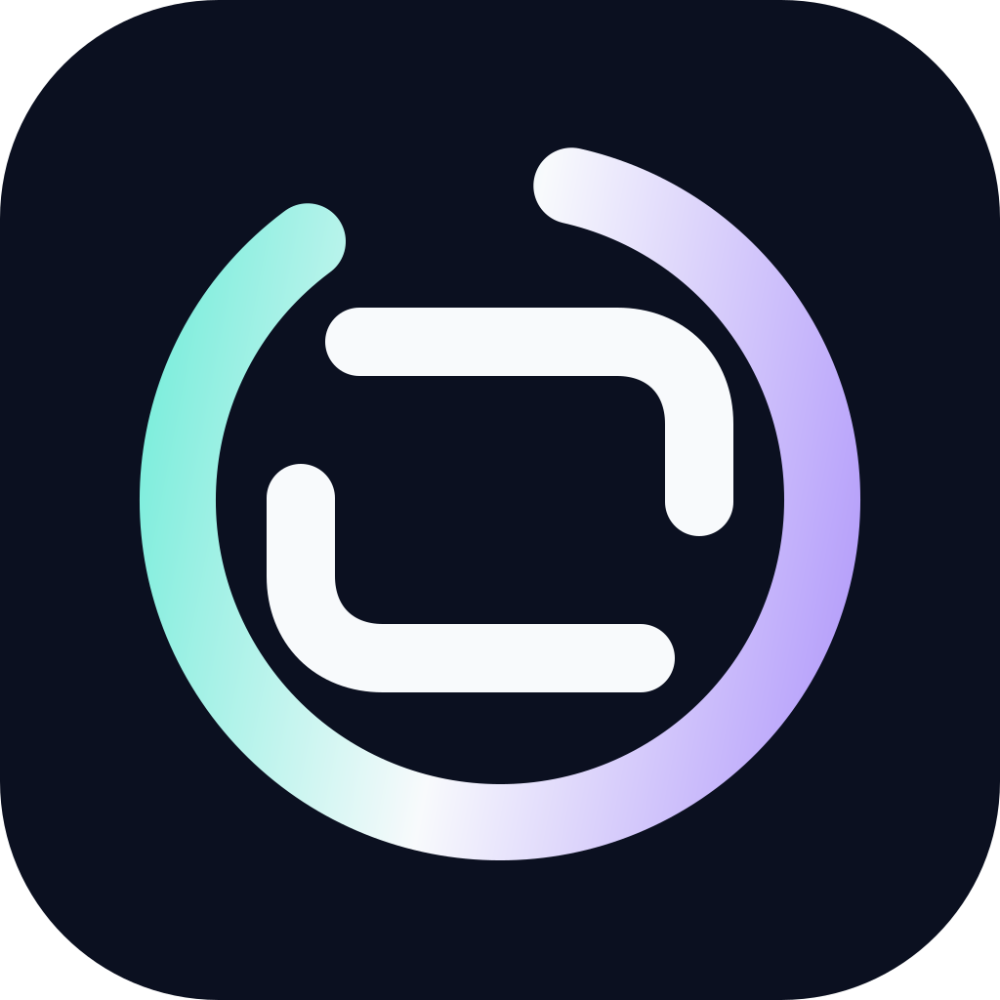
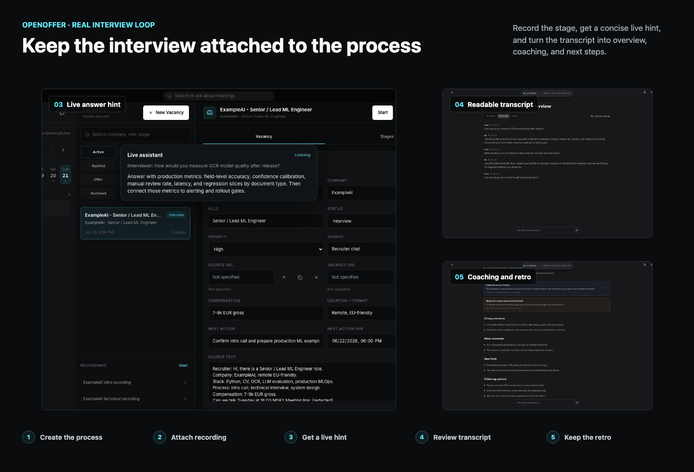
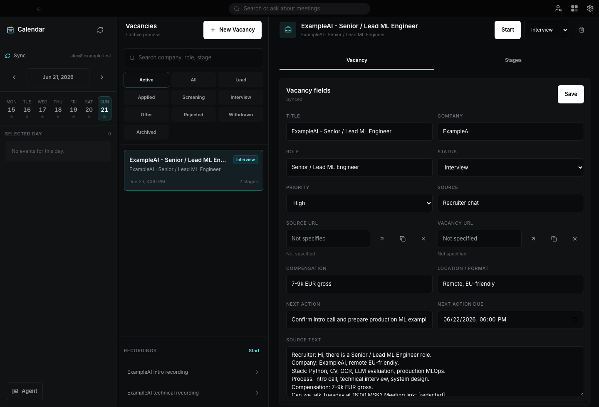
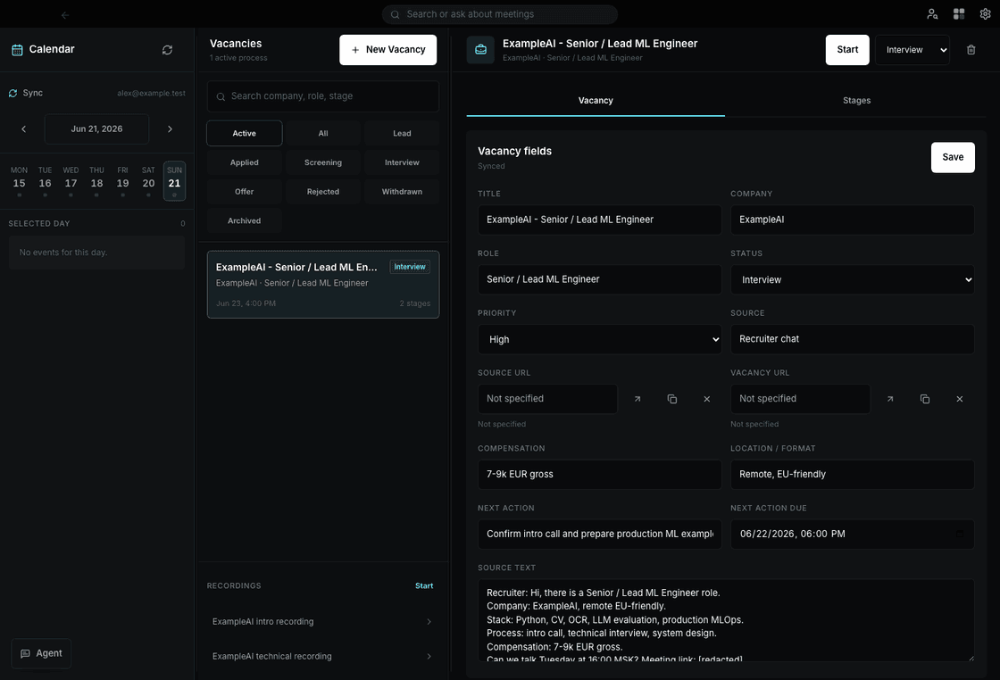
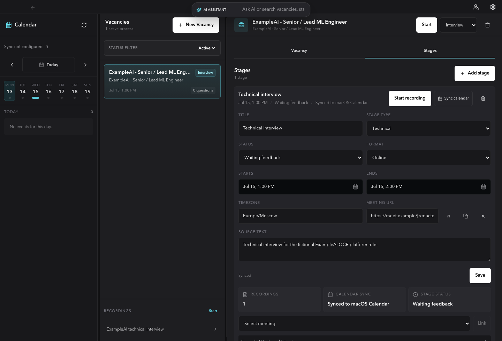
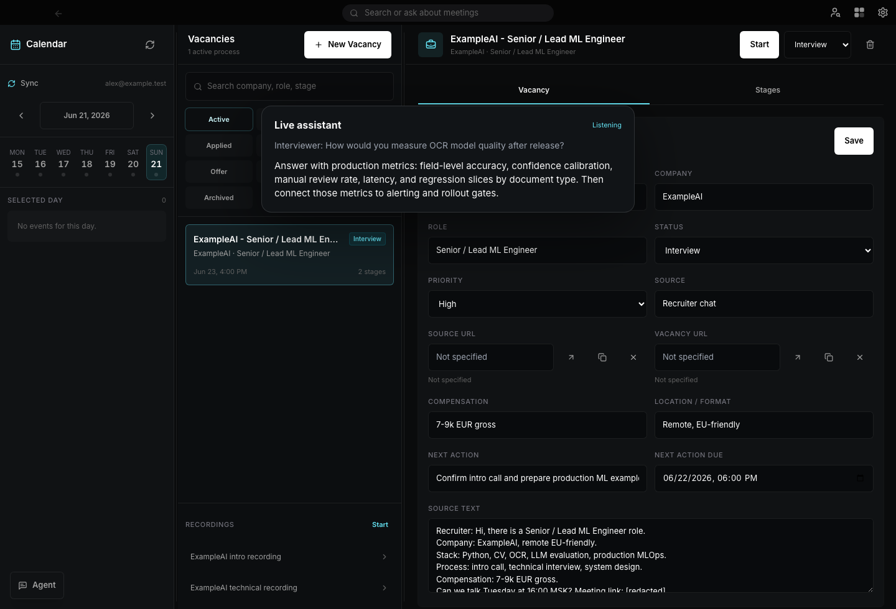
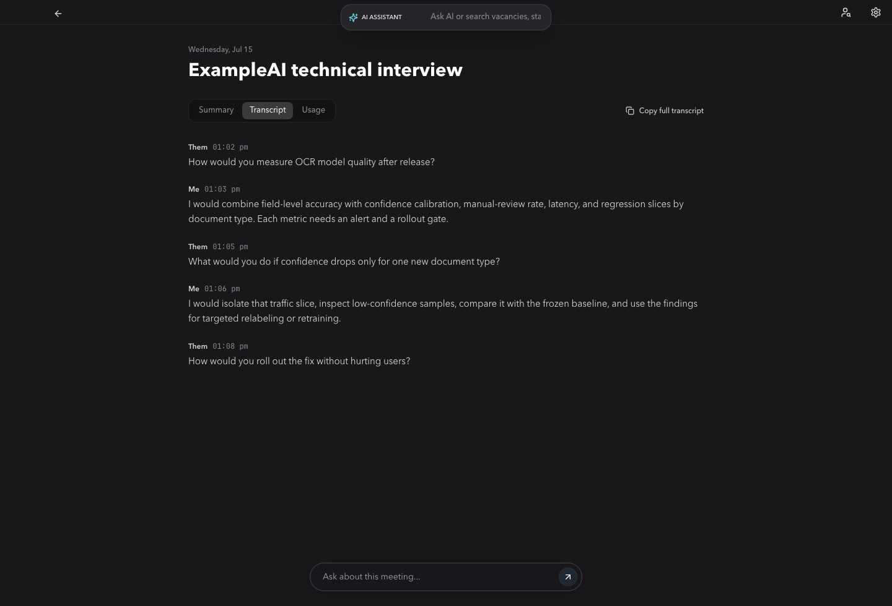
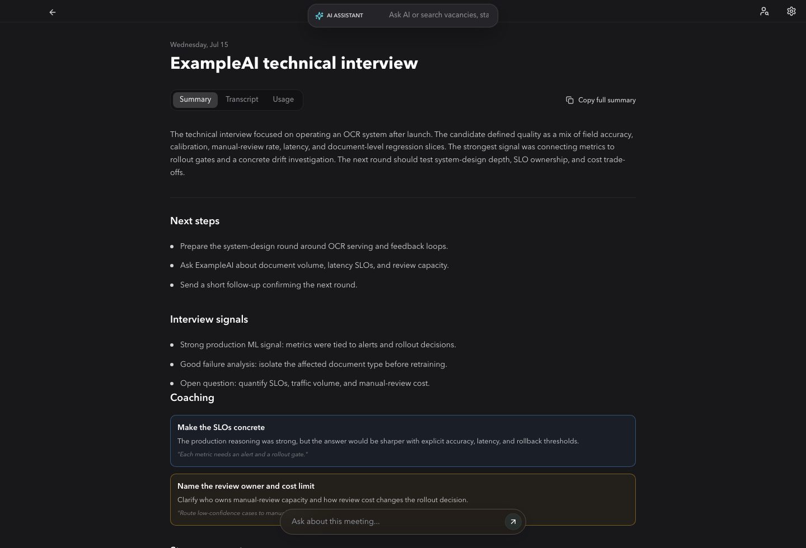
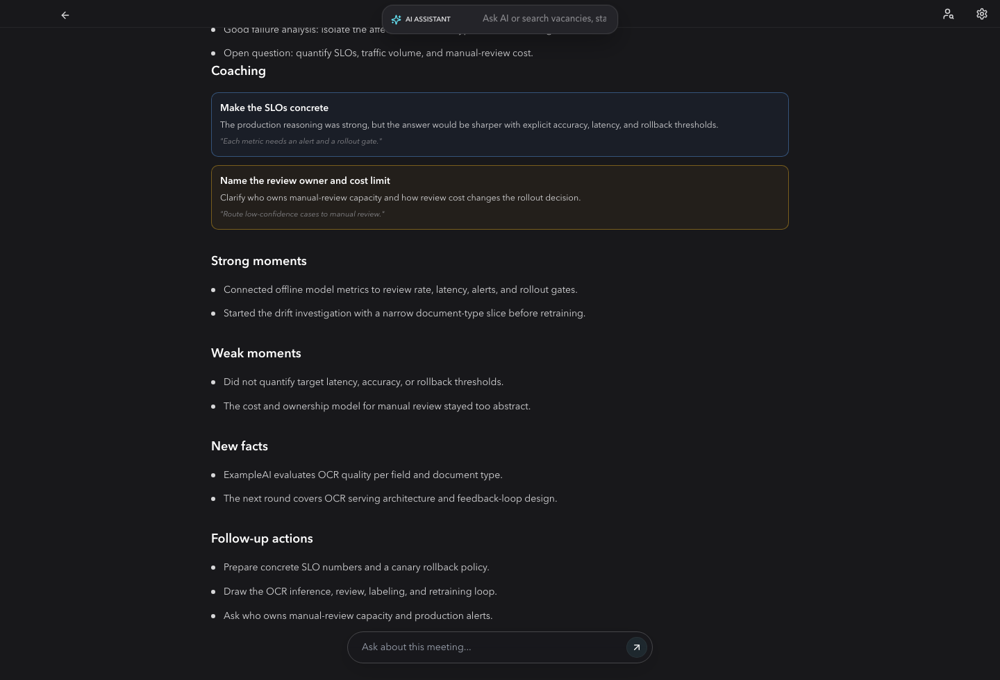

<div align="center">



# OpenOffer

**Your recruiter chat, interview recording, live hints, transcript, and retro in one local workspace.**

[](LICENSE)
[](#system-requirements)
[](#project-status)

<a href="assets/demo/openoffer-real-interview-loop.mp4">
  
</a>

[Watch the 18-second interview loop](assets/demo/openoffer-real-interview-loop.mp4) · [Try the recruiter-chat demo](docs/demo/recruiter-chat-to-process.md) · [Install the preview release](https://github.com/luiz2047/OpenOffer/releases)

</div>

OpenOffer turns messy recruiter messages and interview calls into an inspectable job-search process. Paste a recruiter message, approve the extracted vacancy and stages, start the interview from the right stage, get concise live assistance where it is permitted, and turn the recording into a transcript, overview, coaching, and next actions.

There is no required OpenOffer account or hosted workspace. Workflow state stays on your machine; local providers are the preferred privacy path, and bring-your-own-key cloud providers are optional.

## The Workflow

1. **Before the interview:** turn an HH, Getmatch, Telegram, email, or vacancy message into an editable local process.
2. **During the interview:** start the recording from its stage and keep concise live context close to the call.
3. **After the interview:** review the transcript, overview, coaching, retro, and follow-up actions without losing which vacancy and stage they belong to.

## 1. From Recruiter Chat to Process

OpenOffer proposes changes instead of silently mutating your job-search data:

1. Paste a redacted recruiter message or vacancy text.
2. Review the proposed vacancy, stage, schedule, meeting link, compensation, and prep context.
3. Edit anything that was parsed incorrectly, then save the process locally.



See the exact fictional input and expected output in [Recruiter Chat to Process](docs/demo/recruiter-chat-to-process.md).

## 2. During and After a Real Interview

The recording is linked to the interview stage instead of being dropped into an unrelated meeting list. Live hints stay short enough to scan while speaking. After the call, the transcript becomes stage memory: an overview, interview signals, coaching, structured retro, and follow-up work.



<table>
  <tr>
    <td width="50%">
      <a href="assets/demo/openoffer-15-stage-recording.png"></a>
      <br /><strong>Recording stays with the stage.</strong><br />Start or reopen the right recording from the vacancy timeline.
    </td>
    <td width="50%">
      <a href="assets/demo/openoffer-16-live-answer.png"></a>
      <br /><strong>A concise answer hint appears during the call.</strong><br />Use live assistance only where interview rules permit it.
    </td>
  </tr>
  <tr>
    <td width="50%">
      <a href="assets/demo/openoffer-17-transcript.png"></a>
      <br /><strong>The recording becomes a readable transcript.</strong><br />Speaker turns stay readable and attached to the meeting.
    </td>
    <td width="50%">
      <a href="assets/demo/openoffer-18-stage-overview.png"></a>
      <br /><strong>The transcript becomes an overview.</strong><br />Keep signals, risks, coaching, and next steps in one reviewable place.
    </td>
  </tr>
</table>

<a href="assets/demo/openoffer-19-retro.png"></a>

**The retro survives the call.** Strong moments, weak moments, new facts, and follow-up actions remain available before the next round.

The complete synthetic scenario and recapture instructions are in [Real Interview Loop](docs/demo/real-interview-loop.md). Demo media rules live under [`assets/demo/`](assets/demo/README.md).

## What Works Today

- Reviewed recruiter and vacancy intake into either a new process or a stage on an existing vacancy.
- Interview Command Center for vacancies, stage timelines, schedules, meeting links, linked recordings, and Google/macOS Calendar sync.
- Stage-level microphone and system-audio recording for interviews and professional calls.
- Live transcription and concise meeting assistance through local or BYOK providers.
- Readable transcripts, post-call summaries, interview signals, coaching, and follow-up actions.
- Local SQLite-backed meeting history, job-search state, and retrieval.
- Provider routing for speech-to-text, text, vision/screenshot, and meeting assistance.
- Searchable settings for provider connections, calendar status, and local AI Context.
- English and Russian interface locales plus custom translation packs.
- Electron desktop preview releases for macOS and Windows, with Linux packaging configured for native-platform builds.

## Who It Is For

OpenOffer is especially useful for developers who are actively interviewing and want a workflow they can inspect, edit, and keep on their own machine instead of a hosted black box.

It is intentionally friendly to Russian-speaking job-search workflows: Telegram/HH/Getmatch-style recruiter text, mixed Russian/English interviews, local STT experiments, and BYOK provider setups are first-class contribution areas.

## Privacy Model

Recruiter chats, compensation, resume facts, meeting links, interview transcripts, and retro notes are sensitive career data. OpenOffer keeps the workflow state, recordings, notes, settings, and local retrieval data on your machine by default.

Local data includes:

- Audio captures
- Screen captures
- Transcripts
- Meeting notes
- Reference files
- Settings
- Local SQLite data
- Local embeddings and retrieval state

Data leaves your device only when you configure a provider that needs it. For example, a cloud speech provider receives audio needed for transcription, while a local Whisper setup keeps that path local.

Examples:

| Provider type | Examples |
| :------------ | :------- |
| Local model | Ollama, LM Studio, LocalAI, vLLM, OpenAI-compatible local endpoints |
| Cloud LLM | OpenAI, Anthropic, Google Gemini, Groq, DeepSeek, Yandex AI Studio, OpenAI-compatible endpoints |
| Speech-to-text | Local Whisper, GigaSTT, OpenAI Whisper, Deepgram, ElevenLabs, Google, Azure, IBM Watson, Soniox, Groq Whisper |
| Search | Tavily, when web research is enabled |

Read more:

- [Privacy Policy](PRIVACY.md)
- [Security Policy](SECURITY.md)
- [AGPL FAQ](docs/AGPL_FAQ.md)
- [Notice and upstream attribution](NOTICE.md)

## Quick Start

### System Requirements

- Node.js 22 LTS recommended.
- npm.
- Git.
- Rust toolchain for the native audio module.
- macOS or Windows for current binary preview releases.
- Linux for source builds and platform packaging experiments.

Linux packaging exists in the build configuration, but Linux is not the main tested path yet.

### Run From Source

```bash
git clone https://github.com/luiz2047/OpenOffer.git
cd OpenOffer
npm install
npm run app:dev
```

The install step rebuilds native packages, downloads bundled local models where needed, prepares `sqlite-vec`, and patches Electron metadata.

### Install Current Preview Release

Until Apple Developer ID signing and Windows Authenticode signing are configured, GitHub Release binaries are preview builds. macOS artifacts are unsigned/ad-hoc signed and Windows artifacts are unsigned, so macOS Gatekeeper or Windows SmartScreen may warn before launch.

1. Open the latest [GitHub Release](https://github.com/luiz2047/OpenOffer/releases).
2. Download the right asset:
   - macOS Apple Silicon: `arm64.dmg`
   - macOS Intel: `x64` / non-`arm64` `.dmg`
   - Windows: x64 setup `.exe` or portable `.exe`
3. Download `SHA256SUMS.txt` and verify the file before opening it:

   ```bash
   FILE="OpenOffer-1.5.2-arm64.dmg" # or the asset you downloaded
   grep "  $FILE$" SHA256SUMS.txt | shasum -a 256 -c -
   ```

4. On macOS, open the DMG and drag **OpenOffer** to **Applications**.
5. If macOS blocks the preview build, remove the quarantine flag after checksum verification:

   ```bash
   xattr -dr com.apple.quarantine /Applications/OpenOffer.app
   open /Applications/OpenOffer.app
   ```

6. On Windows, run the x64 setup or portable `.exe`. SmartScreen warnings are expected until Windows code signing is configured.

Use the macOS workaround only for artifacts downloaded from the OpenOffer GitHub Release.

### Useful Development Commands

```bash
npm run app:dev              # Vite + Electron
npm run app:dev:fast         # reuse the last Electron build
npm run build                # renderer typecheck + Vite build
npm run build:electron       # Electron main/preload build
npm run typecheck:electron
npm run i18n:check
npm run test:i18n
npm run test
npm run public-docs:check
```

### Build the Desktop App

```bash
npm run app:build
```

This runs the frontend build, Electron build, native audio build, Sharp checks, and Electron Builder.

Platform-specific packaging should run on the matching OS because OpenOffer ships native `.node` modules:

```bash
npm run app:build:mac        # macOS runner, requires create-dmg, dmg + zip
npm run app:build:win        # Windows runner, x64 NSIS + portable
npm run app:build:linux      # Ubuntu/Linux runner, AppImage + deb
```

For local macOS preview packaging, install `create-dmg` first:

```bash
brew install create-dmg
npm run app:build:mac        # macOS runner, dmg + zip
```

Signed macOS release builds still need Apple Developer ID credentials and GitHub release secrets. Until then, the release workflow publishes unsigned macOS preview artifacts as prereleases. See [OpenOffer release process](docs/RELEASE.md).

## Local and BYOK Providers

You only need one speech provider and one model provider to start.

| Need | Recommended path |
| :--- | :--------------- |
| Private model responses | Ollama or local OpenAI-compatible endpoint |
| Private English STT | Local Whisper |
| Private Russian STT | GigaSTT or compatible local STT setup |
| Local history and recall | SQLite + local retrieval |
| Private screen analysis | Local vision-capable model where available |

Yandex AI Studio needs both an API key and folder ID. See [Yandex AI Studio setup](docs/YANDEX_AI_STUDIO_SETUP.md).

For local speech setup, see [Local STT setup](docs/LOCAL_STT_OPENOFFER_SETUP.md).

## Project Layout

| Path | Purpose |
| :--- | :------ |
| `src/` | React renderer UI |
| `electron/` | Electron main process, services, audio, model routing, persistence |
| `native-module/` | Rust/native audio support |
| `docs/` | Current docs plus archived engineering notes |
| `openoffer-browser/` | Companion browser extension |
| `tests/` | E2E and fixture-based tests |
| `assets/` | App icons and package resources |

## Project Status

Current public version: `1.5.2`.

OpenOffer is a source-first public beta:

- Free and open-source under AGPL-3.0.
- No OpenOffer-hosted account, license server, trial, subscription gate, or metered hosted quota.
- macOS preview binaries are published from GitHub Releases as unsigned/ad-hoc signed prereleases until Apple signing/notarization secrets are configured.
- macOS and Windows are the primary desktop targets; Linux packaging is configured but not the main tested path yet.
- Historical Natively-era documents are kept under `docs/engineering/` and `.github/releases/` for provenance only.

## Roadmap

The near-term roadmap is community-launch focused:

- Keep the recruiter-chat and real-interview demos aligned with the current public UI.
- Improve first-run local provider setup.
- Harden Russian local STT diagnostics.
- Expand focused E2E and contract tests around Interview Command Center.
- Replace unsigned macOS preview releases with signed and notarized artifacts once Apple Developer ID secrets are configured.
- Add more good-first-issue lanes for docs, localization, provider setup, release QA, and privacy hardening.

See [ROADMAP.md](ROADMAP.md) for details.

## Contributing

The best first contributions are small and concrete:

- Try the recruiter-chat demo and report where the process feels unclear.
- Add redacted workflow examples for HH, Getmatch, Telegram, or calendar text.
- Test the real-interview loop on macOS or Windows and improve transcript, overview, or retro capture.
- Improve Russian copy, i18n coverage, or local STT setup docs.
- Document recording consent and responsible live-assistance use in another jurisdiction or interview format.
- Tighten provider setup diagnostics.
- Add focused smoke tests for existing workflows.
- Improve release QA and screenshots.

Start with [CONTRIBUTING.md](CONTRIBUTING.md). Maintainer expectations are in [MAINTAINERS.md](MAINTAINERS.md).

## Responsible Use

OpenOffer is intended for learning, interview preparation, accessibility, note-taking, professional meeting support, and local experimentation with AI-assisted career workflows.

Use live assistance only where it is permitted. Users are responsible for following workplace policies, academic rules, interview guidelines, recording-consent rules, and local laws. OpenOffer is not positioned as a bypass tool for proctoring, recording, or policy enforcement systems.

## Attribution

OpenOffer is a forked and rebranded continuation of earlier Natively-era work. Historical references remain for attribution, provenance, and license continuity only. They do not indicate an active Natively product tier, hosted OpenOffer service, subscription, trial, or paid gate in this public build.

See [NOTICE.md](NOTICE.md) for the current attribution statement.

## License

OpenOffer is licensed under the GNU Affero General Public License v3.0. See [LICENSE](LICENSE) and [AGPL FAQ](docs/AGPL_FAQ.md).

## FAQ

### Is OpenOffer free?

Yes. The public build is free and open source. You may still pay third-party providers directly if you choose to connect BYOK cloud APIs.

### Does OpenOffer require an OpenOffer cloud account?

No. The public build does not create an OpenOffer account, validate licenses, meter hosted quota, or require a subscription.

### Can I run it fully locally?

That is the preferred privacy path. Use a local speech provider and a local model provider such as Ollama or a self-hosted OpenAI-compatible endpoint. Some workflows, especially vision or high-quality model responses, depend on the local models you have available.

### Can I use it for technical interviews?

OpenOffer includes technical-interview, recording, transcription, and screen-context workflows. Use assistance and recording only when the interview, assessment platform, employer, school, or event permits them.

### Where should I ask questions?

Use GitHub Discussions for questions and GitHub Issues for reproducible bugs or scoped feature requests.
